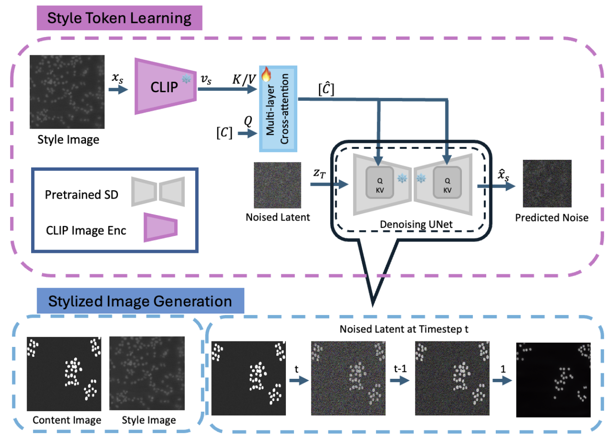
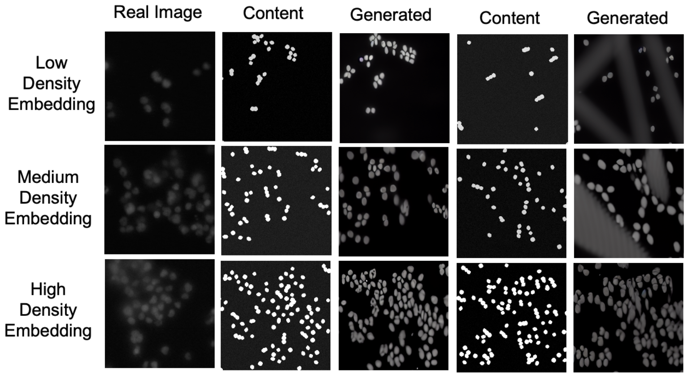

# InST-Microscopy: Reducing Domain Gap with Diffusion-Based Domain Adaptation for Cell Counting

[](https://icmla-conference.org)  
Official repository for our ICMLA 2025 paper:  
**"Reducing Domain Gap with Diffusion-Based Domain Adaptation for Cell Counting"**  
by *Mohammad Dehghanmanshadi, Wallapak Tavanapong*  

---

## 🔍 Overview

Generating realistic synthetic microscopy images is essential when annotated biomedical data is scarce.  
This repository implements **Inversion-Based Style Transfer (InST)**, adapted for microscopy:

- **Latent AdaIN Initialization**: Aligns content and style distributions.  
- **Stochastic Inversion**: Preserves weak structural information.  
- **Style Token Training**: Learns style embeddings from real microscopy images.   

📄 See our paper PDF for full details.

---

## 📊 Pipeline Overview

  
*Figure adapted from our ICMLA 2025 paper. Please cite if you use this work.*  

---

## 📂 Repository Structure

```
├── environment.yaml
├── main.py
├── requirements.txt
├── setup.py
├── verify_lora.py
├── inference.ipynb
├── gradually_increase_num_cells.ipynb
├── configs/
│   ├── autoencoder/
│   ├── latent-diffusion/
│   └── stable-diffusion/
├── evaluation/
│   └── clip_eval.py
├── ldm/
│   ├── lr_scheduler.py
│   ├── util.py
│   ├── data/
│   ├── models/
│   └── modules/
├── models/
│   ├── first_stage_models/
│   └── ldm/
├── scripts/
│   ├── download_first_stages.sh
│   ├── download_models.sh
│   ├── evaluate_model.py
│   ├── inpaint.py
│   ├── sample_diffusion.py
│   ├── stable_txt2img.py
│   ├── stable_txt2style.py
│   └── txt2img.py
├── taming/
│   └── modules/vqvae/quantize.py
└── training/
    ├── README.md
    ├── config.yml
    ├── main.py
    ├── requirements.txt
    ├── utils.py
    ├── data/
    │   └── regression/data.py
    └── models/
        ├── build.py
        └── regression.py
```

---

## 🚀 Getting Started

### Prerequisites

Install environment:

```bash
conda env create -f environment.yaml
conda activate ldm
```

Download the pretrained **Stable Diffusion v1-4** checkpoint from [HuggingFace](https://huggingface.co/CompVis/stable-diffusion-v-1-4-original/resolve/main/sd-v1-4.ckpt) and place it at:

```
./models/sd/sd-v1-4.ckpt
```

### Installation

Clone this repo:

```bash
git clone https://github.com/MohammadDehghan/InST-Microscopy.git
cd InST-Microscopy
```

---

## 🏋️ Training

Train **InST** for style transfer:

```bash
python main.py --base configs/stable-diffusion/v1-finetune.yaml
            -t 
            --actual_resume ./models/sd/sd-v1-4.ckpt
            -n <run_name> 
            --gpus 0, 
            --data_root /path/to/directory/with/images
```

See [`configs/stable-diffusion/v1-finetune.yaml`](./configs/stable-diffusion/v1-finetune.yaml) for more options.

### Training Cell Counting Models

Inside `training/`, we provide code to train:

- **Regression models** (cell counts).  
- **Density map estimation** models.  

These can be trained on real, synthetic, or InST-synthesized datasets.

---


## 🖼️ Sample Results

  
*Figure adapted from our ICMLA 2025 paper. Qualitative results comparing real microscopy images, hard-coded synthetic data, and InST-Microscopy outputs.*  

---

## 📦 Resources

We release the following resources to support reproducibility:

- **Trained Style Embeddings** (per cell density category)  
  [Download from Google Drive](https://drive.google.com/file/d/1NQvhRhUQc5NMf2zi48HlojXbZYZ2zDat/view?usp=drive_link)

- **Datasets**  
  - Hard-coded synthetic data (Syn-HC)  
  - InST-Microscopy generated dataset  

  [Download from Google Drive](https://drive.google.com/file/d/1kC9g09i5wuUs-ssN4bA1u61dQi_YFF9e/view?usp=drive_link)


---

## 🙏 Acknowledgements

Our implementation builds upon the original [InST repository](https://github.com/zyxElsa/InST).  
We thank the authors for making their code available.

---

## 📑 Citation

If you find this repository useful, please cite our ICMLA 2025 paper:

```bibtex
@INPROCEEDINGS{11471519,
  author={Dehghanmanshadi, Mohammad and Tavanapong, Wallapak},
  booktitle={2025 International Conference on Machine Learning and Applications (ICMLA)},
  title={Reducing Domain Gap with Diffusion-Based Domain Adaptation for Cell Counting},
  year={2025},
  pages={1452--1459},
  doi={10.1109/ICMLA66185.2025.00221}
}
```

You can also access the published paper on IEEE Xplore:
https://doi.org/10.1109/ICMLA66185.2025.00221


---

## 📜 License

This project is released under the MIT License. 
